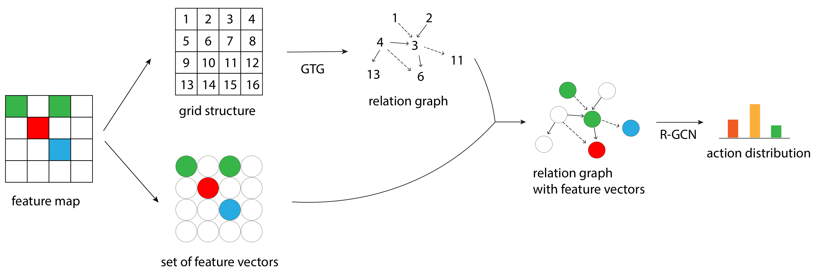

# R-GCN-GTG
Source code of "[Grid-to-Graph: Flexible Spatial Relational Inductive Biases for Reinforcement Learning](https://arxiv.org/abs/2102.04220)" (AAMAS 2021).



> In this work, we show that by leveraging the relational graph of a Relational Graph Convolution Network (R-GCN), we can imbue agents with flexible relational inductive biases. Based on this insight, we propose Grid-to-Graph (GTG), a mapping from grid structures to relational graphs that carry useful spatial relational inductive biases when processed through R-GCN.

The relation determination rules are defined [here](https://github.com/ZhengyaoJiang/GTG/blob/3c17a837a19f4680151b83c347f01658fb629d4a/enviornment/minigrid.py#L27). The set of relation determination rules are defined [here](https://github.com/ZhengyaoJiang/GTG/blob/3c17a837a19f4680151b83c347f01658fb629d4a/enviornment/minigrid.py#L195).

Implemented and tested under python 3.6 in Linux.
The implementation of IMPALA is based on [torchbeast](https://github.com/facebookresearch/torchbeast).
We modified the monobeast in order to support parallel inference.
Logfiles will be stored at ./logs/torchbeast

## Installation
1. Install pytorch geometric that implements R-GCN, following the [official guide](https://pytorch-geometric.readthedocs.io/en/latest/notes/installation.html).
2. `pip install -r requirements.txt`

## Run experiments
### Run a R-GCN-GTG Agent
```
python torchbeast/monobeast.py --env=breakout --agent=GCN --xpid=T-1-1
```
* `--bg_code` can be used to specific the set of relation determination rules.
The default, "b3", is the full GTG with local directional relations, remote directional relations and auxiliary relations in the paper. 
* Use a smaller batchsize if it excess the memory limit.

### Run a CNN Agent
```
python torchbeast/monobeast.py --env=breakout --agent=CNN --cnn_code=2c2f --embedding_size=12 --xpid=T-2-1
```

### Run a NLM Agent
```
python torchbeast/monobeast.py --env=breakout --agent=NLM --xpid=T-3-1 
```

### Citation
```
@inproceedings{jiang2021gtg,
  title={Grid-to-Graph: Flexible Spatial Relational Inductive Biases for Reinforcement Learning},
  author={Jiang, Zhengyao and Minervin, Pasquale and Jiang, Minqi and Rockt{\"a}schel, Tim},
  booktitle={AAMAS 2021},
  year={2021}
}
```